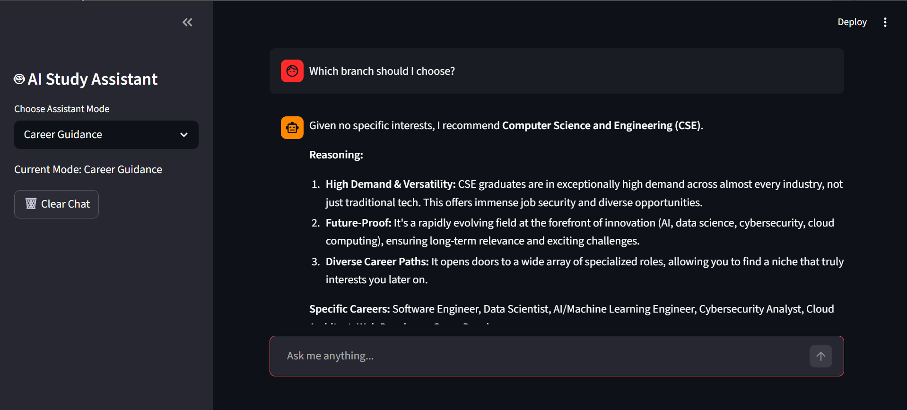
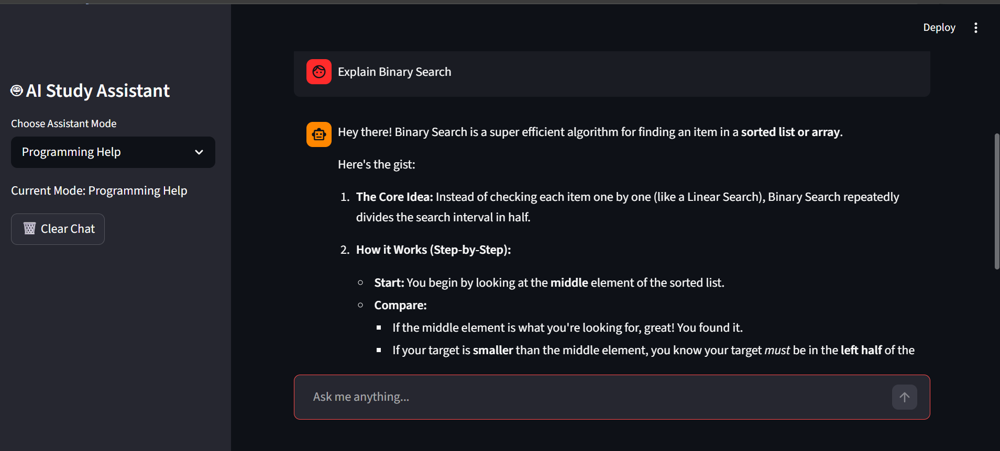

# AI Study Assistant

This project is an AI-powered study assistant that helps students with:

- Engineering career guidance
- Programming concepts and debugging
- AI/ML learning assistance
- Study-related queries

Built using Streamlit and Google's Gemini API.

## Features

- Career Guidance Mode
- Programming Help Mode
- AI Learning Mode
- Chat Memory
- Download Chat History
- User-Friendly Interface

## Technologies Used

- Python
- Streamlit
- Gemini API
- python-dotenv

## Installation

```bash
git clone <repository-url>

cd AI-Study-Assistant

pip install -r requirements.txt

streamlit run app.py
```
## Project Structure

AI-Study-Assistant/
│
├── app.py
├── requirements.txt
├── .env
├── .gitignore
├── README.md
└── screenshots/

## Screenshots

### Home Page


### Career Guidance


### Programming Help


### AI Learning


## Future Enhancements

- Voice Assistant
- PDF Question Answering
- Persistent Memory
- Learning Roadmap Generator

## Author

Durga Lakshmi
